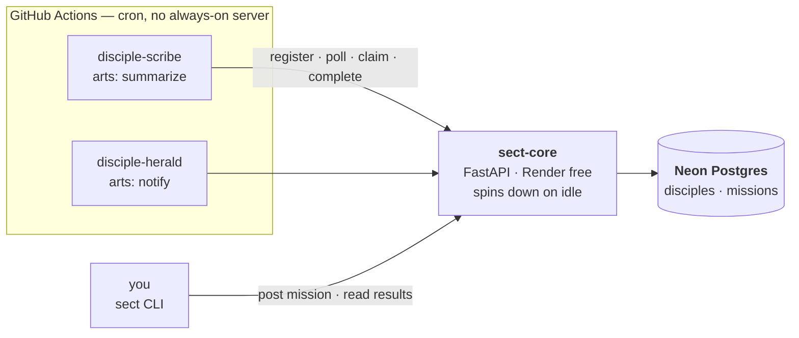
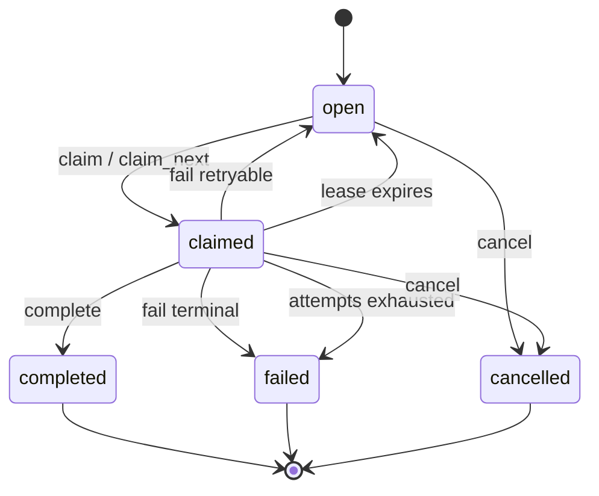

# The Sect — v0.1 Architecture

*Status: implemented as v0.1. §14 records how the open questions were settled and where the
build ended up differing from this plan.*

A hierarchical task-orchestration framework for one person running many small services.
Deliberately small: one HTTP service, one Postgres, two tables, and a claim protocol that
is correct under concurrency.

---

## 0. Decisions locked in

| Question | Decision |
|---|---|
| Failure model | Server-side leases, `attempts`/`max_attempts`, explicit `fail()` with retryable/terminal |
| Auth | Master key (admin) + per-disciple bearer tokens, stored hashed |
| Claim API | Both `claim(mission_id)` and atomic `claim_next(art)` via `FOR UPDATE SKIP LOCKED` |
| Packaging | One repo, one distribution (`the-sect`, imports as `sect`) with `[core]` and `[cli]` extras |

---

## 1. Design principles

These are the rules the rest of the document follows. They're also the rules I'd want in the
README later, because they're what makes this *not* a small Temporal.

1. **The Sect knows *that* work happened, never *how*.** No execution model, no sandbox, no
   code distribution, no runtime. A disciple is an opaque process that reports outcomes.
2. **Postgres is the only coordination primitive.** No queue, no Redis, no leader election, no
   application-level locks, no distributed consensus. If a thing can't be expressed as one
   conditional SQL statement, it isn't in v0.1.
3. **Every state transition is a single guarded `UPDATE`.** Read-then-write is banned on the
   claim path. This is the correctness core of the project (§6).
4. **A disciple assumes nothing about itself.** No inbound port, no uptime, no persistent local
   state, no stable IP. It has a token and outbound HTTPS. A GitHub Actions cron job is the
   reference deployment; an always-on worker is the same code in a `while True`.
5. **One clock.** Every `now()` is evaluated by Postgres. Lease expiry, ordering, and
   `not_before` never trust a runner's clock.
6. **The theme is vocabulary, not obstruction.** Paths and payload keys are plain English;
   the domain words (disciple, mission, art, realm) are the domain words.

---

## 2. Topology



Everything is HTTPS request/response. Nothing pushes to a disciple; disciples always initiate.
That single constraint is what keeps the free-tier deployment viable.

---

## 3. Vocabulary → concrete thing

| Theme term | What it actually is |
|---|---|
| **The Sect** | The `sect-core` FastAPI service plus its Postgres database |
| **Disciple** | A row in `disciples` + a bearer token + a process somewhere that holds it |
| **Art** | A skill tag: a lowercase string. Disciples declare many; a mission requires one |
| **Mission Hall** | The `missions` table and the endpoints over it |
| **Mission** | A row in `missions` |
| **Cultivation Realm** | A tier string on a disciple, granted by the master. Metadata only in v0.1 |
| **Halls / Elders** | Not built. §12 records the seam they'll attach to |

Realms in v0.1, in order: `qi-condensation` → `foundation-establishment` → `core-formation`.
Stored as text with a `CHECK`; the ordering lives in `sect/realms.py` so a dashboard can sort by
rank. Adding a tier later is one migration line plus one list entry.

---

## 4. Data model

Two tables. `gen_random_uuid()` is built into Postgres 13+, so no extensions are needed on Neon.

### 4.1 `migrations/0001_init.sql`

```sql
CREATE TABLE schema_migrations (
    version     text PRIMARY KEY,
    applied_at  timestamptz NOT NULL DEFAULT now()
);

CREATE TABLE disciples (
    id            uuid PRIMARY KEY DEFAULT gen_random_uuid(),
    name          text NOT NULL UNIQUE
                    CHECK (name ~ '^[a-z0-9][a-z0-9-]{0,62}[a-z0-9]$'),
    display_name  text,
    arts          text[] NOT NULL CHECK (cardinality(arts) > 0),
    realm         text NOT NULL DEFAULT 'qi-condensation'
                    CHECK (realm IN ('qi-condensation',
                                     'foundation-establishment',
                                     'core-formation')),
    repo_url      text,
    description   text,
    agent_version text,                       -- self-reported build id, for debugging
    token_hash    text NOT NULL UNIQUE,       -- sha256 hex of the bearer token
    active        boolean NOT NULL DEFAULT true,
    last_seen_at  timestamptz,
    created_at    timestamptz NOT NULL DEFAULT now(),
    updated_at    timestamptz NOT NULL DEFAULT now()
);

CREATE INDEX disciples_arts_gin ON disciples USING gin (arts);

CREATE TABLE missions (
    id                uuid PRIMARY KEY DEFAULT gen_random_uuid(),
    title             text NOT NULL CHECK (length(title) BETWEEN 1 AND 200),
    description       text,
    required_art      text NOT NULL CHECK (length(required_art) BETWEEN 1 AND 64),
    payload           jsonb NOT NULL DEFAULT '{}'::jsonb,
    priority          smallint NOT NULL DEFAULT 0,          -- higher runs sooner
    status            text NOT NULL DEFAULT 'open'
                        CHECK (status IN ('open','claimed','completed','failed','cancelled')),

    -- retry / lease machinery
    attempts          smallint NOT NULL DEFAULT 0,
    max_attempts      smallint NOT NULL DEFAULT 3 CHECK (max_attempts BETWEEN 1 AND 100),
    lease_seconds     integer  NOT NULL DEFAULT 900 CHECK (lease_seconds BETWEEN 30 AND 86400),
    not_before        timestamptz NOT NULL DEFAULT now(),

    -- holder, set only while status = 'claimed'
    claimed_by        uuid REFERENCES disciples(id) ON DELETE SET NULL,
    claim_token       uuid,                   -- server secret, NEVER serialized into a mission
    claimed_at        timestamptz,
    lease_expires_at  timestamptz,

    -- outcome
    result            jsonb,
    error             text,

    idempotency_key   text UNIQUE,
    posted_by         text NOT NULL DEFAULT 'master',   -- 'master' or a disciple name
    created_at        timestamptz NOT NULL DEFAULT now(),
    updated_at        timestamptz NOT NULL DEFAULT now(),
    finished_at       timestamptz,

    CONSTRAINT claimed_implies_holder CHECK (
        status <> 'claimed'
        OR (claimed_by IS NOT NULL AND claim_token IS NOT NULL AND lease_expires_at IS NOT NULL)
    ),
    CONSTRAINT terminal_implies_finished CHECK (
        status NOT IN ('completed','failed','cancelled') OR finished_at IS NOT NULL
    )
);

-- the poll/claim hot path; partial so the growing tail of finished missions is excluded
CREATE INDEX missions_claimable_idx
    ON missions (required_art, priority DESC, created_at)
    WHERE status IN ('open','claimed');

CREATE INDEX missions_browse_idx     ON missions (created_at DESC, id DESC);
CREATE INDEX missions_status_idx     ON missions (status);
CREATE INDEX missions_claimed_by_idx ON missions (claimed_by) WHERE claimed_by IS NOT NULL;

CREATE FUNCTION sect_touch_updated_at() RETURNS trigger
LANGUAGE plpgsql AS $$
BEGIN
    NEW.updated_at := now();
    RETURN NEW;
END $$;

CREATE TRIGGER disciples_touch BEFORE UPDATE ON disciples
    FOR EACH ROW EXECUTE FUNCTION sect_touch_updated_at();
CREATE TRIGGER missions_touch  BEFORE UPDATE ON missions
    FOR EACH ROW EXECUTE FUNCTION sect_touch_updated_at();
```

### 4.2 Notes on specific choices

- **`claim_token`** is a per-claim secret returned only in the claim response. Every write by a
  disciple (`complete`, `fail`, `heartbeat`) must present it. Without it, a disciple whose lease
  expired mid-run could finish late and overwrite the result of the disciple that redid the
  work. It is deliberately absent from every serialized mission object.
- **Holder-field residue.** After a completion the holder columns are *not* cleared, so a
  retried `complete` can be recognised as a replay rather than a conflict (§7.10). The API
  serializer reports `claimed_by` / `claimed_at` / `lease_expires_at` as `null` whenever
  `status <> 'claimed'`, so this is invisible on the wire.
- **`not_before`** carries two jobs: schedule-for-later, and retry backoff after a failure.
- **`idempotency_key`** stops a re-run GitHub Actions job from posting the same mission twice.
  A repeat post returns `200` with the existing mission rather than an error.
- **`posted_by`** is provenance for the day a disciple starts posting missions of its own.
- Indexes are sized for growth, not for current load. At a solo developer's volume, Postgres
  would seq-scan happily; they're here so the design doesn't need revisiting.

---

## 5. Mission lifecycle



| Transition | Trigger | Guard |
|---|---|---|
| → `open` | `POST /v1/missions` | — |
| `open` → `claimed` | claim / claim_next | `not_before <= now()`, `attempts < max_attempts`, atomic |
| `claimed` → `claimed` | lease expiry, then re-claim by anyone | `lease_expires_at <= now()`, `attempts < max_attempts` |
| `claimed` → `completed` | `complete` | caller is holder **and** presents `claim_token` |
| `claimed` → `open` | `fail(retryable=true)` | attempts remain; `not_before` pushed out by backoff |
| `claimed` → `failed` | `fail(retryable=false)`, or attempts exhausted | holder proof, or sweep (§6.4) |
| any non-terminal → `cancelled` | `cancel` | master key only |

**`open` is a predicate, not just a column.** A mission is *claimable* when:

```
not_before <= now()
AND attempts < max_attempts
AND (status = 'open' OR (status = 'claimed' AND lease_expires_at <= now()))
```

Expired leases are recovered by the claim statement itself, so there is no reaper process to
run, host, or keep awake — which matters when the host spins down on idle.

---

## 6. The atomic claim

This is the part that has to be right. Everything else is CRUD.

### 6.1 Claim a specific mission

```sql
-- sql.CLAIM_MISSION   $1 = mission id, $2 = claiming disciple id, $3 = lease override or NULL
UPDATE missions AS m
SET status           = 'claimed',
    claimed_by       = $2,
    claim_token      = CASE WHEN m.status = 'claimed' AND m.claimed_by = $2
                            THEN m.claim_token ELSE gen_random_uuid() END,
    attempts         = CASE WHEN m.status = 'claimed' AND m.claimed_by = $2
                            THEN m.attempts    ELSE m.attempts + 1  END,
    claimed_at       = CASE WHEN m.status = 'claimed' AND m.claimed_by = $2
                            THEN m.claimed_at  ELSE now()           END,
    lease_expires_at = now() + make_interval(secs => COALESCE($3, m.lease_seconds))
WHERE m.id = $1
  AND m.not_before <= now()
  AND (
        (m.status = 'open'    AND m.attempts < m.max_attempts)
     OR (m.status = 'claimed' AND m.lease_expires_at <= now() AND m.attempts < m.max_attempts)
     OR (m.status = 'claimed' AND m.claimed_by = $2)     -- retry-safe re-claim by the holder
  )
RETURNING m.*;
```

One row returned → you hold it, and the response carries the `claim_token`.
Zero rows → `409 mission_not_claimable`. There is no third outcome.

The third `WHERE` branch makes the endpoint safe to retry: if a disciple's claim succeeded but
the HTTP response was lost, retrying returns the **same** `claim_token` and does **not** burn an
attempt. It's the only branch without an `attempts` guard, because re-claiming what you already
hold isn't a new attempt.

### 6.2 Why one statement is sufficient

1. Every statement runs in a transaction; PostgreSQL's default isolation is **READ COMMITTED**.
2. Two concurrent `UPDATE`s targeting the same row serialize on that row's exclusive lock. The
   second one **blocks**; it does not proceed on a stale snapshot.
3. When the first commits, the second does not blindly apply its update. Under READ COMMITTED,
   Postgres re-fetches the newly committed row version and **re-evaluates the `WHERE` clause
   against it** (`EvalPlanQual`). `status` is now `'claimed'` with a fresh lease, every branch
   fails, and the row leaves the update set.
4. The loser therefore affects **0 rows**, `RETURNING` yields nothing, and the API returns 409.

Exclusivity comes from the row lock plus predicate re-evaluation. There is no check-then-act
window because there is no separate check.

### 6.3 What would break it

A checklist for review, and for anyone porting the protocol to another language:

- **Splitting into `SELECT … WHERE status='open'` then `UPDATE`.** Two statements, two snapshots,
  a window in between. This is the classic double-claim bug. Not permitted even inside one
  transaction unless the `SELECT` takes `FOR UPDATE`.
- **Raising the isolation level.** Under `REPEATABLE READ` or `SERIALIZABLE`, step 3 aborts with
  `could not serialize access due to concurrent update` instead of quietly matching zero rows.
  Still correct, but it turns a normal outcome into an error the app must catch. v0.1 asserts
  the default READ COMMITTED and never changes it.
- **Trusting a client clock.** All timestamps in the claim path come from Postgres `now()`.
  CI runners drift; the database doesn't.
- **Deciding the winner in application code** by comparing `claimed_by` after the fact. The only
  evidence of a win is a returned row.
- **Accepting a completion without holder proof.** See `claim_token` in §4.2 and §7.10.
- **Retrying a claim without server-side idempotency.** Handled by §6.1's third branch.

### 6.4 Claim the next matching mission

```sql
-- sql.CLAIM_NEXT   $1 = disciple id, $2 = text[] of arts, $3 = lease override or NULL
UPDATE missions AS m
SET status           = 'claimed',
    claimed_by       = $1,
    claim_token      = gen_random_uuid(),
    attempts         = m.attempts + 1,
    claimed_at       = now(),
    lease_expires_at = now() + make_interval(secs => COALESCE($3, m.lease_seconds))
WHERE m.id = (
    SELECT c.id FROM missions AS c
    WHERE c.required_art = ANY($2::text[])
      AND c.not_before <= now()
      AND c.attempts < c.max_attempts
      AND (c.status = 'open'
           OR (c.status = 'claimed' AND c.lease_expires_at <= now()))
    ORDER BY c.priority DESC, c.created_at ASC
    FOR UPDATE SKIP LOCKED
    LIMIT 1
)
RETURNING m.*;
```

`FOR UPDATE SKIP LOCKED` is the canonical Postgres job-queue pattern: concurrent callers skip
rows another transaction has locked rather than queueing behind them. Twenty disciples waking on
the same cron minute against twenty missions get a clean 1:1 assignment with zero contention and
zero retries. Zero rows → `204 No Content`, meaning "nothing for you right now".

### 6.5 Completion, failure, and the zombie sweep

```sql
-- sql.COMPLETE_MISSION   $1 = mission id, $2 = disciple id, $3 = result jsonb, $4 = claim_token
UPDATE missions
SET status = 'completed', result = $3, error = NULL, finished_at = now()
WHERE id = $1 AND claimed_by = $2 AND claim_token = $4 AND status = 'claimed'
RETURNING *;
```

Zero rows triggers one diagnostic `SELECT` so the 409 can say *why* (`lease_expired`,
`reclaimed`, `cancelled`), and so an exact replay — same mission, same holder, same
`claim_token`, already `completed` — returns `200` idempotently instead of failing a retry.

```sql
-- sql.FAIL_MISSION  $5 = retryable bool, $6 = retry_after_seconds or NULL
UPDATE missions
SET status = CASE WHEN $5 AND attempts < max_attempts THEN 'open' ELSE 'failed' END,
    error  = $3,
    not_before       = CASE WHEN $5 AND attempts < max_attempts
                            THEN now() + make_interval(secs => COALESCE($6, 60))
                            ELSE not_before END,
    claimed_by       = CASE WHEN $5 AND attempts < max_attempts THEN NULL ELSE claimed_by END,
    claim_token      = CASE WHEN $5 AND attempts < max_attempts THEN NULL ELSE claim_token END,
    claimed_at       = CASE WHEN $5 AND attempts < max_attempts THEN NULL ELSE claimed_at END,
    lease_expires_at = CASE WHEN $5 AND attempts < max_attempts THEN NULL ELSE lease_expires_at END,
    finished_at      = CASE WHEN $5 AND attempts < max_attempts THEN NULL ELSE now() END
WHERE id = $1 AND claimed_by = $2 AND claim_token = $4 AND status = 'claimed'
RETURNING *;
```

```sql
-- sql.SWEEP_EXHAUSTED — garbage-collect zombies so the board stays honest
UPDATE missions
SET status = 'failed', finished_at = now(),
    error  = CASE WHEN error IS NULL THEN 'lease expired; attempts exhausted'
                  ELSE error || ' | lease expired; attempts exhausted' END
WHERE status = 'claimed' AND lease_expires_at <= now() AND attempts >= max_attempts
RETURNING id;
```

The sweep exists only because a mission that has burned all its attempts stops matching the
claimable predicate while still sitting in `claimed`. It runs at the top of
`GET /v1/missions/open`, `POST /v1/missions/claim-next`, and `POST /v1/admin/sweep`.

*Trade-off, stated plainly:* this makes a `GET` perform a write. At a few polls per minute
against an almost-always-empty predicate that costs nothing, and it removes the need for a
scheduler on a host that sleeps. If read replicas ever appear, move it to the admin endpoint plus
a cron.

---

## 7. HTTP API

Base path `/v1`. JSON in and out. Timestamps are RFC 3339 UTC (`2026-08-12T10:00:00Z`).
IDs are UUID strings. Disciples are addressed by `name` in URLs and in `claimed_by`; their UUIDs
never leave the server.

### 7.1 Authentication

`Authorization: Bearer <token>`, resolved to one of two principals:

| Principal | Token | Can |
|---|---|---|
| **Master** | `SECT_MASTER_KEY` env var, compared with `hmac.compare_digest` | Everything: create/patch disciples, rotate tokens, post, cancel, sweep, read all |
| **Disciple** | `sect_d_…`, issued once at registration, stored as sha256 | Update own record, poll, claim, heartbeat, complete, fail, post missions, read |

Disciple tokens are `secrets.token_urlsafe(32)` behind a `sect_d_` prefix — the prefix makes them
recognisable to secret scanners and to you in a log. An `active = false` disciple's token is
rejected with `401 disciple_inactive`. There is no unauthenticated endpoint except `/health`.

### 7.2 Errors

One envelope everywhere, via a FastAPI exception handler that overrides the default
`{"detail": …}` shape:

```json
{ "error": { "code": "mission_not_claimable",
             "message": "Mission is claimed by disciple 'scribe' until 2026-08-12T10:15:00Z.",
             "detail": { "status": "claimed", "claimed_by": "scribe" } } }
```

`400` malformed · `401` bad/missing token · `403` wrong principal · `404` unknown ·
`409` state conflict · `422` schema validation · `503` database unreachable.

### 7.3 Endpoint index

| Method | Path | Principal | Purpose |
|---|---|---|---|
| GET | `/health` | none | Liveness + DB check |
| POST | `/v1/disciples` | master | Register a disciple, issue its token |
| GET | `/v1/disciples` | any | List disciples and their status |
| GET | `/v1/disciples/{name}` | any | One disciple |
| PUT | `/v1/disciples/me` | disciple | Announce/refresh own metadata (SDK `register()`) |
| PATCH | `/v1/disciples/{name}` | master | Grant a realm, deactivate, edit arts |
| POST | `/v1/disciples/{name}/token` | master | Rotate token |
| POST | `/v1/missions` | any | Post a mission |
| GET | `/v1/missions/open` | any | Poll claimable missions |
| POST | `/v1/missions/claim-next` | disciple | Atomically claim the best match |
| POST | `/v1/missions/{id}/claim` | disciple | Atomically claim a specific mission |
| POST | `/v1/missions/{id}/heartbeat` | holder | Extend the lease |
| POST | `/v1/missions/{id}/complete` | holder | Report success + result |
| POST | `/v1/missions/{id}/fail` | holder | Report failure |
| POST | `/v1/missions/{id}/cancel` | master | Cancel |
| GET | `/v1/missions/{id}` | any | Read one mission (and its result) |
| GET | `/v1/missions` | any | Browse/filter, keyset paginated |
| GET | `/v1/stats` | any | Counts by status and art |
| POST | `/v1/admin/sweep` | master | Run the zombie sweep on demand |

### 7.4 Object shapes

**Mission** (every endpoint returning a mission returns exactly this):

```json
{
  "id": "b2c1…",
  "title": "Summarize the week's commits",
  "description": "Group by area, note anything that touches the claim path.",
  "required_art": "summarize",
  "payload": { "repo": "you/thing", "since": "2026-08-05" },
  "priority": 0,
  "status": "claimed",
  "attempts": 1,
  "max_attempts": 3,
  "lease_seconds": 900,
  "not_before": "2026-08-12T09:00:00Z",
  "claimed_by": "scribe",
  "claimed_at": "2026-08-12T09:02:11Z",
  "lease_expires_at": "2026-08-12T09:17:11Z",
  "result": null,
  "error": null,
  "idempotency_key": "weekly-digest-2026-W32",
  "posted_by": "master",
  "created_at": "2026-08-12T08:59:40Z",
  "updated_at": "2026-08-12T09:02:11Z",
  "finished_at": null
}
```

`claim_token` never appears here — only in a claim response. Otherwise any authenticated disciple
could read another's token off `GET /v1/missions/{id}` and steal its completion.

**Disciple:**

```json
{
  "name": "scribe",
  "display_name": "The Scribe",
  "arts": ["summarize", "transcribe"],
  "realm": "qi-condensation",
  "repo_url": "https://github.com/you/disciple-scribe",
  "description": "Turns long documents into short ones.",
  "agent_version": "2026.08.12+a1b2c3d",
  "active": true,
  "last_seen_at": "2026-08-12T09:02:10Z",
  "created_at": "2026-07-01T12:00:00Z",
  "stats": { "claimed": 1, "completed": 42, "failed": 3 }
}
```

### 7.5 `POST /v1/disciples` — master

```json
{ "name": "scribe", "display_name": "The Scribe",
  "arts": ["summarize", "transcribe"],
  "repo_url": "https://github.com/you/disciple-scribe",
  "description": "Turns long documents into short ones." }
```

`201 → { "disciple": {…}, "token": "sect_d_…" }`. **The token is shown exactly once**; only its
hash is stored. `409 disciple_exists` on a duplicate name. `realm` is not accepted here — a new
disciple always starts at `qi-condensation`.

### 7.6 `PUT /v1/disciples/me` — disciple → SDK `register()`

All fields optional; supplied ones overwrite, and `last_seen_at` is always bumped. This is what a
disciple calls on every wake-up, so its declared arts always reflect the code that's deployed.

`realm` is rejected with `403 realm_is_granted` — a disciple cannot promote itself. Ascension is
`PATCH /v1/disciples/{name}` with the master key, which fits both the theme and the security
model: realm is a claim *about* a disciple, made by the Sect.

### 7.7 `POST /v1/missions` — master or disciple

Only `title` and `required_art` are required.

```json
{ "title": "Summarize the week's commits",
  "description": "optional prose, for a human or an LLM disciple",
  "required_art": "summarize",
  "payload": { "repo": "you/thing", "since": "2026-08-05" },
  "priority": 0,
  "lease_seconds": 900,
  "max_attempts": 3,
  "not_before": null,
  "idempotency_key": "weekly-digest-2026-W32" }
```

`201` with the mission. If `idempotency_key` already exists, `200` with the existing mission —
a replay, not an error. `posted_by` is filled in server-side from the principal.

### 7.8 `GET /v1/missions/open` — the poll

`?art=summarize&art=transcribe&limit=20`. **If the caller is a disciple and `art` is omitted, it
defaults to that disciple's registered arts** — so `poll_missions()` with no arguments does the
obvious right thing. Returns claimable missions (§5) ordered by `priority DESC, created_at ASC`.
Runs the sweep first. `200 → { "missions": [...], "count": 3 }`.

### 7.9 Claiming

`POST /v1/missions/{id}/claim`, body `{ "lease_seconds": 1800 }` (optional).

```json
{ "mission": { … "status": "claimed" … }, "claim_token": "9f1e…" }
```

`409 mission_not_claimable` with `detail.status` and `detail.claimed_by`, so a losing disciple
can log something useful and move on. Re-claiming a mission you already hold returns the same
`claim_token` (§6.1).

`POST /v1/missions/claim-next`, body `{ "arts": [...], "lease_seconds": 1800 }` (both optional,
`arts` defaults to the caller's). Same success shape; `204 No Content` when the board is empty.

### 7.10 Finishing

| Endpoint | Body | Notes |
|---|---|---|
| `…/heartbeat` | `{ "claim_token": "…", "extend_seconds": 900 }` | `200 → { "lease_expires_at": … }` |
| `…/complete` | `{ "claim_token": "…", "result": { … } }` | Result is arbitrary JSON |
| `…/fail` | `{ "claim_token": "…", "error": "upstream 502 after 3 tries", "retryable": true, "retry_after_seconds": 300 }` | Terminal if not retryable or attempts exhausted |

All three require the caller to be `claimed_by` **and** to present the matching `claim_token`.
Otherwise `409 not_mission_holder` with `detail.reason` ∈ `lease_expired` · `reclaimed` ·
`already_completed` · `cancelled`. An exact `complete` replay by the true holder returns `200`.
A `fail` replay returns `409`, which the SDK treats as benign — the mission is already back on
the board or terminal, and the disciple is exiting anyway.

### 7.11 Reads

`GET /v1/missions?status=open&art=summarize&claimed_by=scribe&limit=50&cursor=…` — ordered
`created_at DESC`, keyset paginated on `(created_at, id)`, response
`{ "missions": [...], "next_cursor": "…" }`.

`GET /v1/stats` → `{ "missions": { "open": 3, "claimed": 1, "completed": 128, "failed": 4,
"cancelled": 0 }, "by_art": { "summarize": {…} }, "disciples": { "total": 5, "active": 5 } }`.
This is the data source for the dashboard that doesn't exist yet.

`GET /health` → `{ "status": "ok", "db": "ok", "version": "0.1.0", "time": "…" }`, `503` if the
database is unreachable. No auth, so Render can use it as its health check path.

---

## 8. The client SDK

`sect/client.py`. Depends on `httpx` and the shared pydantic models — nothing else. **Sync only**
in v0.1, because a cron job is a sync script; an async client is additive later.

Two classes, split by principal, so you can't accidentally hand a disciple the master key:

```python
from sect import Disciple, SectMaster, Mission, MissionNotClaimable

d = Disciple(
    name="scribe",
    arts=["summarize", "transcribe"],
    base_url=None,  # default: $SECT_URL
    token=None,  # default: $SECT_TOKEN
    repo_url=None,
    agent_version=None,
    timeout=30.0,
    connect_timeout=90.0,  # generous: the host may be cold-starting
    max_retries=4,
)
```

### 8.1 The core four

```python
d.register()                             -> DiscipleRecord   # PUT /v1/disciples/me
d.poll_missions(art=None, limit=20)      -> list[Mission]    # GET /v1/missions/open
d.claim(mission_id, lease_seconds=None)  -> Mission          # raises MissionNotClaimable
d.complete(mission_id, result)           -> Mission
```

`claim()` stores the returned `claim_token` in an in-memory map keyed by mission id, so
`complete()` and friends take a bare mission id and the token never appears in disciple code.

### 8.2 What leases and claim-next add

```python
d.claim_next(art=None, lease_seconds=None)                    -> Mission | None
d.fail(mission_id, error, retryable=True, retry_after=None)   -> Mission
d.heartbeat(mission_id, extend_seconds=None)                  -> datetime
```

### 8.3 One convenience wrapper

The entire body of a cron disciple, built on the primitives above — register, claim one mission,
run it, complete with the handler's return value, or fail with the traceback:

```python
def handle(mission: Mission) -> dict:
    return {"summary": summarize(mission.payload["repo"])}


if __name__ == "__main__":
    d.run_once(handle)  # returns the Mission, or None if the board was empty
```

This is the only method in the SDK that is not a direct wrapper around an endpoint. It is ~25
lines over the primitives and it earns them: the reference deployment becomes a five-line file,
and the claim/complete/fail bookkeeping stops being copy-pasted into every disciple repo.

### 8.4 Master side

```python
m = SectMaster(base_url=None, master_key=None)   # $SECT_URL, $SECT_MASTER_KEY
m.register_disciple(name, arts, repo_url=None)   -> (DiscipleRecord, token)
m.post_mission(title, required_art, payload=None, priority=0, **kw) -> Mission
m.missions(status=None, art=None, limit=50)      -> list[Mission]
m.mission(mission_id)                            -> Mission
m.cancel(mission_id)                             -> Mission
m.disciples()                                    -> list[DiscipleRecord]
m.grant_realm(name, realm)                       -> DiscipleRecord
m.rotate_token(name)                             -> str
```

### 8.5 Retry policy — the SDK owns it, not each disciple

Free-tier hosting means the first request of the day may hit a cold container. Every disciple
shouldn't have to know that.

- **Retry** on connection errors, read timeouts, `429`, `502`, `503`, `504` — exponential backoff
  with full jitter, `max_retries` attempts.
- **Never retry** other `4xx`; they're deterministic.
- `claim` is safe to retry because the server makes re-claim idempotent (§6.1).
- `complete` is safe to retry because an exact replay returns `200` (§7.10).

### 8.6 Exceptions

```
SectError
├── SectUnavailable      network failure or 5xx after all retries
├── AuthError            401 / 403
├── NotFound             404
├── MissionNotClaimable  409 from claim
└── NotMissionHolder     409 from complete / fail / heartbeat
```

---

## 9. Repo layout

```
the-sect/
├── README.md
├── LICENSE
├── pyproject.toml              # dist "the-sect", import "sect", extras: core, cli, dev
├── .env.example
├── Dockerfile
├── render.yaml
├── .github/workflows/ci.yml    # ruff + pytest against a postgres service container
├── docs/
│   ├── sect-architecture.md    # this document
│   ├── protocol.md             # the wire contract, for non-Python disciples
│   └── writing-a-disciple.md
├── migrations/
│   └── 0001_init.sql
├── src/sect/
│   ├── __init__.py             # exports Disciple, SectMaster, Mission, exceptions
│   ├── models.py               # pydantic wire contract — one source of truth, both sides
│   ├── realms.py               # ordered cultivation realms
│   ├── errors.py
│   ├── client.py               # THE SDK — the single module a disciple imports
│   ├── cli.py                  # [cli] extra
│   └── core/                   # [core] extra — a disciple never imports this
│       ├── app.py              # FastAPI app, lifespan, exception handlers
│       ├── settings.py
│       ├── db.py               # asyncpg pool + migration runner
│       ├── auth.py             # principal resolution
│       ├── sql.py              # every SQL statement, named, in one file
│       └── routes/
│           ├── disciples.py
│           ├── missions.py
│           └── meta.py         # health, stats, sweep
├── examples/disciple-scribe/   # copy-paste starting point for a new disciple
│   ├── main.py
│   ├── requirements.txt
│   └── .github/workflows/cultivate.yml
└── tests/
    ├── conftest.py
    ├── test_claim_atomicity.py
    ├── test_lease_expiry.py
    ├── test_auth.py
    └── test_api.py
```

**Install paths.** A disciple runs `pip install the-sect` and gets `httpx` + `pydantic` and
nothing else. The server image installs `the-sect[core]`; your laptop installs `the-sect[cli]`.
`models.py` is imported by both sides, so the wire contract can't drift between client and server.

**Three deliberate choices, each reversible:**

- **Raw SQL over asyncpg, no ORM.** The correctness of this project *is* the SQL. An ORM would
  bury the claim behind a query builder and add a dependency and cold-start weight for two tables
  with no query complexity. Every statement lives in `core/sql.py` as a named constant so it can
  be reviewed and tested in isolation — which matters for an open-source project whose main claim
  is "the claim is atomic".
- **Numbered `.sql` migrations, no Alembic.** One table of applied versions, applied on boot
  behind `pg_advisory_lock` so two instances during a deploy can't race, and via
  `python -m sect.core.db migrate`. Two tables don't need autogeneration. Adopting Alembic later
  is a baseline stamp and nothing else.
- **The name is confined to two places** — the distribution name in `pyproject.toml` and the
  import root `src/sect/`. No database object, endpoint path, or env var is derived from it, so
  renaming the project is a `git mv` and one line.

---

## 10. Configuration

**Server**

| Variable | Required | Default | Notes |
|---|---|---|---|
| `DATABASE_URL` | yes | — | Neon URL, `?sslmode=require` |
| `SECT_MASTER_KEY` | yes | — | ≥32 chars; constant-time compared |
| `SECT_DEFAULT_LEASE_SECONDS` | no | `900` | |
| `SECT_MAX_LEASE_SECONDS` | no | `86400` | Upper bound on client overrides |
| `SECT_DEFAULT_MAX_ATTEMPTS` | no | `3` | |
| `SECT_MAX_POLL_LIMIT` | no | `100` | |
| `SECT_DB_POOL_MIN` / `_MAX` | no | `1` / `5` | Stay inside Neon's free connection budget |
| `SECT_DB_PGBOUNCER` | no | `false` | See §11 — sets `statement_cache_size=0` |
| `SECT_AUTO_MIGRATE` | no | `true` | Apply pending migrations on boot |
| `LOG_LEVEL` | no | `INFO` | Structured JSON logs, mission id + disciple on every line |

**Client:** `SECT_URL`, `SECT_TOKEN`. **CLI:** adds `SECT_MASTER_KEY`.

**CLI** (`[cli]` extra, typer + rich — kept out of the disciple install):

```
sect disciples                                    # table: name, arts, realm, last seen, stats
sect disciple create scribe --art summarize --repo …
sect disciple grant scribe foundation-establishment
sect disciple rotate scribe
sect mission post "Summarize the week" --art summarize --payload @payload.json --priority 5
sect missions --status open --art summarize
sect mission show <id>                            # including the result
sect mission cancel <id>
sect stats
```

---

## 11. Deployment

**Neon.** Free-tier compute autosuspends after a few minutes idle and resumes in well under a
second, so a polling disciple just sees a slightly slow first query — no keep-alive needed. Use
the **direct** (non-pooled) endpoint with an asyncpg pool of max 5; a single small instance
doesn't need PgBouncer. If you ever switch to Neon's pooled endpoint, asyncpg **must** run with
`statement_cache_size=0` or prepared statements break intermittently under transaction-mode
pooling — hence the `SECT_DB_PGBOUNCER` flag. A separate Neon branch makes a free, isolated test
database if you'd rather not run Postgres locally.

**Render (free web service).** Spins down after a stretch without inbound traffic; a cold start is
on the order of tens of seconds. That single fact drives the SDK's 90-second connect timeout and
retry policy (§8.5) — it is the main operational consequence of the free tier, and it belongs in
the SDK so no disciple has to rediscover it. Single uvicorn worker, bind `0.0.0.0:$PORT`, health
check path `/health`, config committed as `render.yaml`.

*Fly.io is the reasonable alternative:* auto-stop/auto-start Machines wake in seconds rather than
tens of seconds, which suits polling better, at the cost of slightly more setup. Nothing in this
design depends on the choice. Both providers change their free tiers periodically — worth
confirming current limits before you commit.

**A disciple as a GitHub Actions cron:**

```yaml
on:
  schedule: [{ cron: "*/15 * * * *" }]
  workflow_dispatch:
concurrency: { group: scribe, cancel-in-progress: false }
```

Two GitHub behaviours to design around, both already handled: scheduled workflows are
**best-effort** and can be delayed by many minutes at peak, and they're **disabled after 60 days**
of repo inactivity. This is exactly why the design leans on `priority` and leases rather than on
a predictable poll cadence.

---

## 12. Deliberately not in v0.1

| Deferred | The seam it attaches to |
|---|---|
| **Halls & Elders** | Add a `halls` table + `disciples.hall_id`; missions gain an optional hall filter. Nothing in v0.1 blocks it |
| **`mission_events`** append-only audit log | One insert per transition. First thing to add when debugging gets annoying |
| **Dashboard UI** | `GET /v1/stats` and the list endpoints are already its data source |
| **Queue transport** (Upstash/ARQ) | Would replace polling, not the schema — the claim contract is transport-agnostic |
| **Auto-promotion between realms** | `stats` already carries the completion counts a rule would read |
| **Rate limiting, mission archival, completion webhooks, multi-art missions, recurring missions** | Noted, not designed |

**Before any of these land, read this:** `GET /v1/missions/open` performs a write — the zombie
sweep (§6.5) rides along on polling because a host that sleeps has no scheduler. That coupling is
accepted for v0.1, but it means `missions/open` **cannot be put behind a read replica or an HTTP
cache** while it holds. Whoever adds a queue transport, a dashboard that polls hard, or a read
replica has to move the sweep to `POST /v1/admin/sweep` plus a cron *first*.

---

## 13. Design calls worth knowing about

None of these are load-bearing. Each is a one-line change if it turns out to be wrong:

1. **Raw SQL + asyncpg, no ORM** (§9).
2. **Numbered `.sql` migrations, no Alembic** (§9).
3. **`name` is the public identifier** for disciples; UUIDs stay server-side.
4. **Realm is granted by the master**, never self-declared (§7.6).
5. **Disciples may post missions** (provenance in `posted_by`); only the master manages disciples
   and cancels missions.
6. **Sync-only SDK** — cron jobs are sync scripts.
7. **`claim_token` never appears in a mission object** (§7.4).
8. **`run_once(handler)`** is the only SDK method that is not a thin wrapper over an endpoint
   (§8.3).

## 14. Questions left open by the plan

Four questions were still open when this document was first written. All four were settled while
building, and the reasoning is recorded here so it does not have to be reconstructed later:

1. **Name — settled as `the-sect` (distribution) / `sect` (import).** Still confined to
   `pyproject.toml` and `src/sect/`, so a rename stays a `git mv` plus one line.
2. **License — Apache-2.0.** Explicit patent grant, which matters more than brevity for something
   intended to be adopted as a protocol.
3. **Realm ladder — three tiers.** `qi-condensation` → `foundation-establishment` →
   `core-formation`. Extending it is one `Literal` entry in `sect/realms.py` plus a migration
   widening the `CHECK`; `test_realms_match_database` fails loudly if the two ever drift.
4. **Mission read scope — tightened to master + holder + poster.** `GET /v1/missions/{id}` and
   `GET /v1/missions` now reject a disciple that is neither the current holder nor the account in
   `posted_by`. *Poster* was added to the master-plus-holder rule because disciples are permitted
   to post missions (§13.5), and a poster that cannot read its own mission's result has no way to
   collect the work it commissioned. `GET /v1/missions/open` stays visible to any disciple — you
   cannot decide whether to claim a mission you are not allowed to read the brief of. That
   endpoint only ever exposes unclaimed work, never a `result`.

### 14a. Where the build differs from the plan

Each of these is a mechanical necessity rather than a change of direction, but they move or
reshape things this document specified:

- **Migrations live at `src/sect/core/migrations/`, not `/migrations`.** They are applied on boot,
  so they must ship inside the wheel and the container image. A repo-root directory would not be
  packaged.
- **`schema_migrations` is created by the runner, not by `0001_init.sql`.** The runner has to read
  that table to decide whether `0001` has run yet, so it cannot be `0001`'s output.
- **Holder-field masking narrowed.** The plan masked `claimed_by`, `claimed_at` and
  `lease_expires_at` on any non-`claimed` mission. Only `lease_expires_at` is masked now: which
  disciple completed a mission is real history and the obvious thing to want from a finished
  board, and `claimed_by` is already public via `/v1/disciples`. Missions returned to `open` by a
  retryable failure have their holder columns cleared in SQL, so nothing stale leaks.
- **Disciples may only poll their own registered arts.** `GET /v1/missions/open?art=…` returns
  `403` for an art the caller has not declared; the master may query any. Consistent with
  tightening read scope now rather than retrofitting.
- **Python floor is 3.11**, and settings are parsed from `os.environ` by hand rather than adding
  `pydantic-settings` — one less dependency in the container and one less thing to cold-start.

### 14b. Where the SDK differs from §8

- **The timeouts in §8 were the wrong way round.** The plan set `timeout=30` with
  `connect_timeout=90`. On a free-tier host the edge accepts the TCP connection immediately and
  *holds the request* while the container boots, so a cold start reads as a slow **response**, not
  a slow connect. Corrected to `timeout=90.0` / `connect_timeout=15.0`.
- **`PermanentFailure` added** to the exception hierarchy in §8.6. Without it, every exception a
  `run_once` handler raises is retryable, so a mission with a malformed payload burns its whole
  attempt budget proving that a retry cannot fix it.
- **`backoff_base` / `backoff_cap` are constructor arguments** on both clients, not just internal
  constants. Needed so the retry tests exercise the policy without sleeping through it, and
  useful to anyone tuning for a slower host.
- **`transport=` is an injection point** on both clients. It is how the retry tests simulate a
  lost response, and it lets a caller supply proxy or TLS behaviour without the SDK growing
  options for each.
- **The SDK retries `claim_next`,** which is the one call in the protocol that is *not*
  idempotent. A lost `claim-next` response leaves a mission held by a disciple that never learned
  it won; the retry takes the next mission instead, and the orphan comes back through its lease.
  That is leases doing exactly their job, and it is strictly better than the alternative — not
  retrying means a cron disciple gives up for fifteen minutes over one dropped packet.
  `test_sdk_retries_a_lost_claim_next_response` pins this behaviour, orphan and all.
- **The CLI has `--json` on its read commands.** It is the only interface to the Sect until a
  dashboard exists, and a status tool you cannot pipe into `jq` is half a tool.

### 14c. The rest of the documentation

This document is the design record and assumes the reader wants to know *why*. The other three
answer different questions:

- `README.md` — what this is, and the five-line disciple.
- `docs/protocol.md` — the wire contract, standalone, for writing a disciple in a language other
  than Python. It restates the parts of §14a and §14b that are visible on the wire, so an
  implementer never has to read this file.
- `docs/writing-a-disciple.md` — a walk through `examples/disciple-scribe/`.

---

## 15. Test plan

The tests that justify the design, all against a real Postgres (a `postgres:16` service container
in CI — free on GitHub Actions).

- **`test_claim_atomicity`** — one mission, 20 disciples calling `claim` concurrently via
  `asyncio.gather`. Assert exactly one `200`, nineteen `409`s, and `attempts == 1`.
- **`test_claim_next_distribution`** — 20 missions, 20 disciples, all calling `claim-next` at
  once. Assert a perfect 1:1 assignment: no mission claimed twice, no disciple empty-handed.
- **`test_lease_expiry`** — claim, expire the lease, re-claim from a second disciple, assert
  `attempts == 2`; then assert the first disciple's `complete` gets `409 reclaimed` and does
  **not** overwrite the second's result. This is the scenario `claim_token` exists for.
- **`test_sweep`** — a mission at `max_attempts` with an expired lease becomes `failed`, not a
  permanent zombie.
- **`test_claim_retry_idempotent`** — claiming twice from the same disciple returns the same
  `claim_token` and does not increment `attempts`.
- **`test_complete_replay`** — completing twice with the same token returns `200` both times.
- **`test_auth_matrix`** — master-only endpoints reject disciple tokens; identity-bearing
  endpoints reject the master key; an inactive disciple's token is rejected everywhere.
